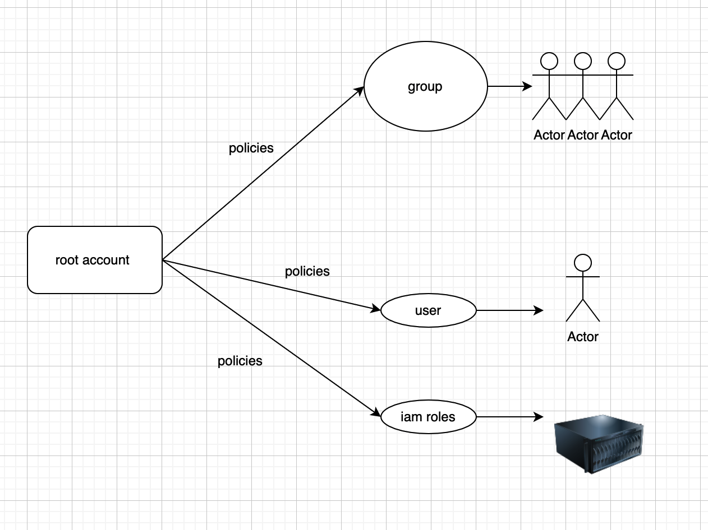

# IAM in AWS

## A diagram for AWS Account, users, group, IAM policies, IAM Roles

## Overview of IAM
Understanding Identity and Access Management (IAM) and using it correctly is a key to the correct design and security of any application running in AWS. The initial section of this chapter looks at the basics of IAM, which are described in more detail in later sections of the chapter.

## Identity Principals in IAM
the users, groups, roles, and policies that you use in IAM to assign and grant permissions.

## Identity Providers and Federation
Applications with huge numbers of users and applications with functionality outside AWS need to be authenticated. For these types of use cases, IAM supports federation with external identity providers.

## Implementing Application Authentication and Authorization
Building on the knowledge gained in the previous sections of this chapter, this section describes how to implement authentication and authorization into an application by using AWS IAM and federated directories.

## Encryption in AWS Services
Encryption is another key part of securing application data. The last section of this chapter provides some architectural understanding of how and where encryption can be implemented in AWS.

This chapter covers content important to the following exam domain:

Domain 2: Security

2.1 Make authenticated calls to AWS services.

2.2 Implement encryption using AWS services.

2.3 Implement application authentication and authorization.
